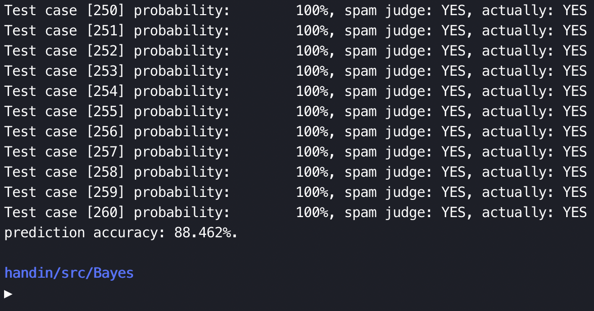
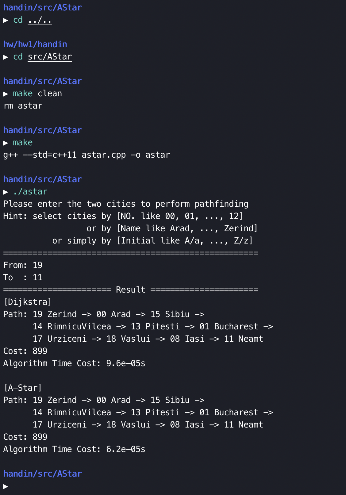
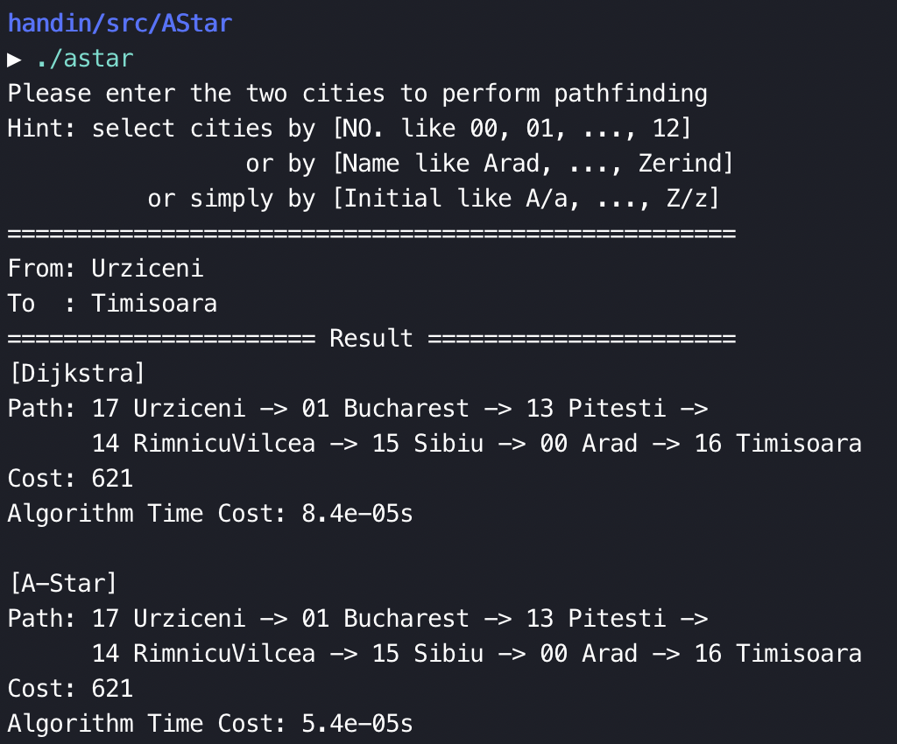
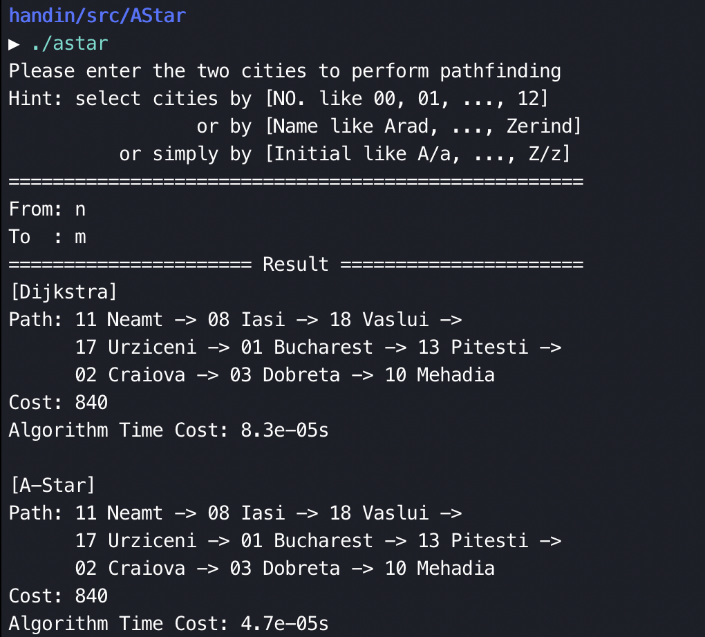

# 人工智能原理 Homework1

> 数据科学与计算机学院 软件工程专业 17343131 许滨楠

## Bayesians

### 基础过滤器训练和使用

根据应用情景设定，垃圾邮件和正常邮件的先验概率都为 1/2，即 $P(S) = P(H) = 50%$%。(s for spam, h for health)

通过使用训练数据集对过滤器进行训练，可以在较大的样本中获知：

- 某个单词在垃圾邮件中的出现概率 $P(W|S)$ ；
- 该在正常邮件中的出现概率 $P(W|H)$。

根据贝叶斯过滤器的使用规则，在以单个单词作为根据的情况下，可以获知该单词出现的前提条件下，所判断邮件为垃圾邮件的概率 $P(S|W)$。可以通过公式计算：$P(S|W) = \frac{P(W|S)P(S)}{P(W|S)P(S) + P(W|H)P(H)}$

将上述所得先验概率和训练得单词出现概率等已知量代入，即可计算出基于单个单词判断的邮件为垃圾邮件的可能性。

### 联合概率的使用

> 具体理论启示和证明参考的是[这篇博客](https://www.cnblogs.com/csguo/p/7804683.html)。

因为基于单个单词的判定可靠性较差，考虑利用联合概率的计算来提高过滤器的判定能力。利用概率统计的知识，可以综合多个单词作为判定依据，来更好地判断某邮件为垃圾邮件的概率。详细的证明在博客中，此处暂不赘述，最终所得联合概率的计算公式为：$P=\frac{P_1 P_2 ... P_i}{P_1 P_2 ... P_i + (1-P_1)(1-P_2)...(1-P_i)}$。

通过反复测试，如果使用大小为 700 的训练数据集进行训练，可以较好地覆盖邮件中可能出现的单词。所以这里的判断所依据的单词数量为邮件出现的单词总数，即会将每一个出现的单词所预示的垃圾邮件概率考虑在内进行判断。

### 其他参数设置

#### 训练集

测试数据提供了多个训练集供使用，经过实际测试，训练集越大测试效果越好，所以最终成品选择使用最大的体量为 700 的训练集对过滤器进行训练。

#### 概率阙值

经过验证，在有较大训练集支持之下，过滤器校验出来的概率成“两极分化”，所以判定是否为垃圾邮件的概率阙值影响不会很大，选择 0.8 ~ 0.9 范围内皆可。

#### 依据单词数量

实验中，如果参考博客使用影响系数最大的前 n 个单词的联合概率进行判断，会因为影响系数过于偏向判定为垃圾邮件而出现全部判定为垃圾邮件的结果。最终选择直接将所有单词都作为依据计算联合概率判定，在训练集较大的情况下表现良好。（考虑到难免会有一些判断力较弱的单词出现，可以考虑在总单词数量的基础上减去一定数量得到依据总数 n，并将邮件中判断力最强的前 n 个单词作为依据计算联合概率进行判断，也许会得到更好的性能表现）。

#### 其他先验预设

如果某个单词只在垃圾邮件或者非垃圾邮件中出现，则会出现概率值为 0 的极端情况，为了避免其引起计算过程中不必要的麻烦，实现中设定该单词在非垃圾邮件或者垃圾邮件（即从未出现过的类型）中出现的概率为 0.01，即体现了其出现的倾向性，又防止了计算中因为极端情况出现错误。

为了防止误判并提高过滤器的可靠性和容错率，实现中规定，如果某个单词从未出现过，即过滤器对该单词的识别未经过训练，则判定该单词的 $P(S|W)$ 为 0.4，即倾向于该单词的出现倾向于判定该邮件不是垃圾邮件，因为正常邮件中出现训练集之外的单词概率更高，而垃圾邮件中会使用的单词往往比较固定。

### 代码简析

因为训练和测试的思路比较直接，所以只简析大致的流程即可，具体代码见压缩包目录中的 `/src/`，后续会有详细的运行方式说明。

```c++
// 对每个单词使用以下结构体进行记录统计
typedef struct stat {
    int s_times; // 垃圾邮件中出现次数
    float s_p;   // 垃圾邮件中出现概率
    int h_times; // 非垃圾邮件中出现次数
    float h_p;   // 非垃圾邮件中出现概率
} stat;

// 创建全局字典wordlist用于生成训练统计集，int为单词编号
map<int, stat> dict;

// 训练过程
void training(int train_data_size);
/*
 * 读入训练文件，对其中的每封邮件进行扫描
 * 如果出现某个单词，则该单词在字典中的计数+1（每封邮件每个单词只计一次）
 * 最后根据单词出现次数和邮件数量分别计算垃圾邮件和非垃圾邮件中该单词的出现概率
 * 同时根据贝叶斯公式计算出每个单词的 P(S|W)
 */

// 测试过程
void testing(float judge_threshold);
/* 
 * 读入测试文件，对其中的每封邮件进行扫描
 * 创建针对该邮件创建的单词库，存储出现的所有单词及训练所得的对应 P(S|W)
 * 对整个单词库依据 P(S|W) 进行排序，选择前 n 个或者直接选择全部计算联合概率
 * 根据联合概率结果，与设定阙值比较，作出判断
 * 将判断结果与实际结果做比较，统计判断的正确次数和准确率
 */
```

实现比较简单，不加赘述，下面展示运行结果并说明运行方式。

#### 代码运行

源代码见 `/src/Bayes/bayes.cpp`。运行方法为：

```shell
# cd 到相应目录下
cd src/Bayes/
# 使用 makefile 进行编译
make
# 运行可执行文件
./bayes
```

#### 本地运行结果

> makefile 编写得比较简陋，可能兼容性较差。需要使用 c++11 标准用 g++ 进行编译。
>
> 下面展示在本地的测试运行结果。判断准确率为 88.462%

##### 700 训练集




> 测试得其他训练集的准确率逐级降低（可以在主函数中修改参数 `train_data_size` 进行调整），训练集大小对应的准确率分别为：
>
> - 400 - 85%
> - 100 - 81.154%
> - 50 - 55.385%
>
> （具体运行过程可以见 `img/` 目录中截图，这里不一一罗列。


---


## A*

> 这里实现的 A* 算法是 Dijkstra 算法基础上的启发式拓展。并在实现中对两者进行了比较，具体可以参见后续说明以及运行结果展示。

### 启发函数 h(n) 设置

初次尝试 A* 算法，思路比较基础。

根据题目中已经给定的一组以 Bucharest 为重点的 h(n)，考虑利用三**角形的三边关系**对整个无向图进行“**松弛**”。

实现上参考了 Floyd-Warshall 算法的思路，对**每一对城市 A 和 B**，如果两者之间**不存在已经生成的通路**或者其**路径长度比接下来将要找到的路径长**，则在整个地图上寻找其**中间节点 C**，该中介点到两个选定城市间都会有一条原先存在或是已经估算生成的路径 A-C 和 B-C。而根据三角形的三边关系，两个选定城市的实际距离 A-B 通常会比其两者各自到中介点的距离的和要短，即 $AB \leq AC + BC$。由于给定无向图比较难准确计算出具体的三边关系比例，所以这里采用在已知的**两边之和的基础上减去一个随机数**（这个随机数的设计会保证不对启发函数值的大小产生颠覆性的影响，并且在可能要进行的几次松弛过程中，不会导致路径长度减少过多而产生极端情况），用以生成并表示两边之间的期望距离。对整个无向图进行**多次松弛**，即可生成完整的 h(n) （实现中选择**松弛五次**，因为根据无向图的体量情况，五次松弛可以跨越 6 个点以上生成直通路径，可以较好地覆盖整个测试图）。松弛过程代码如下：

```c++
void relax() {
    for (int relax_time = 0; relax_time < 5; ++relax_time) {
        for (int i = 0; i < 20; ++i) {
            for (int j = i+1; j < 20; ++j) {
                // 初始化过程中已经将原先联通的点的启发函数值设置为路径长度
                // 标记原先生成过的启发函数值，接下来寻找可能存在的更小值
                int original_cost = h[i][j], t_cost = MAX;
                // 寻找中介点
                for (int k = 0; k < 20; ++k) {
                    // 不联通的点直接舍弃
                    if (h[i][k] == MAX || h[k][j] == MAX) {
                        continue;
                    }
                    // 利用三边关系估算大致的第三边开销
                    int temp = h[i][k] + h[k][j] - getRandom();
                    t_cost = t_cost < temp ? t_cost : temp;
                }
                // 找到了更近的路径，更新启发函数（其实是一个常数数组）
                if (t_cost < original_cost) {
                    h[i][j] = h[j][i] = t_cost;
                }
            }
        }
    }
}
```

> 因为启发函数设置是 A* 算法中比较关键的部分，所以这里直接贴了代码并加上注释。

这里的启发函数，通过生成每个点到终点的大致路径长度预估，对整个搜索过程产生启示作用：

如果在接下来搜索分支路口上，选点会综合考虑**当前已经生成的扩展点集到新点的距离 g(n)** 以及**新点到目标点的预计代价 h(n)** ，这两个代价的综合值越小则该点的优先级越高。因为启发函数预示着接下来的搜索方向是在靠近还是远离目标点，所以可以带有倾向性地加快搜索进度。（不过这种启发函数在应对路径之间有障碍物之类的测试样例中表现就比较差了）

### 总体算法设计

说明白启发函数之后剩下的内容就比较容易表示了。其实就是将该图手动进行初始化生成二维邻接矩阵，再经过松弛得到完整的启发函数，最后利用简单的 Dijkstra 算法综合考虑上启发函数进行搜索计算。只是因为需要找到路径，所以不能简单维护路径开销，还要维护一个自定义结构体用来获取生成的具体联通路径。

维护结构体如下：

```c++
typedef struct city_path {
    int index; // 标记城市序号
    int cost;  // 存储当前已经生成的到此城市的路径开销
    vector<int> path; // 按序通过的城市指示路径
    bool visited; // 标记是否已经搜索过
    int f; // 存储松弛生成的此城市到目的地的预估代价（启发函数）
} city_path;
```

初始化过程只是手动录入题目中的无向图，略去。松弛过程前面已述。

总体运行过程中，会提示用户输入意欲搜索的起始点和目的地，输入城市编号（按照城市名的字母表顺序编号为 00 ~ 19）或是城市名称或是城市首字母皆可。然后获取搜索起始点，分别调用纯 Dijkstra 算法和 A* 算法进行搜索计算，同时统计时间，最后打印搜索结果路径、开销、算法耗时，方便进行比较。

A* 算法就是 Dijkstra 算法启发式的改进，所以这里直接阐述 A* 算法即可：

```c++
city_path astar(int src, int dst) {
    // 算法维护结构体数组
    city_path dis[20];

    // 针对起始点，初始化该数组
    // cost - 如果某点可达，则设置为起始点到其的路径长度，否则则为大常数
    // f - 初始化为之前松弛所得的该点到终点的启发函数值和路径长度的综合值
    // visited - 除了起点都为false，表示未计算过
    // path - 如果可达，则将其前序点（此时为起点）推入该vector
    
    // while true 不断迭代搜索
    //     找到当前综合值 f 最小且未访问过的点
    //     this.visited = true 表示已经访问过
    //     在已访问集已经加入该点的时候对结构体数组进行更新
    //         如果新增的点到未访问过的点中有比现存更短的路径（维护在 dis[i].cost 中）
    //             则进行更新，更新其距离和综合代价
    //     继续进行下一次迭代搜索，直到找到的点是终点
}
```


### 代码运行

源代码见 `/src/AStar/astar.cpp`。运行方法为：

```shell
# cd 到相应目录下
cd src/AStar/
# 使用 makefile 进行编译
make
# 运行可执行文件
./astar
# 根据程序提示进行输入
```

#### 本地运行结果

这里展示程序的运行和城市选择的指令以及实际运行时的性能比较。



以上是运行时大致的行为表现。这里选择从 19 号城市 Zerind 到 11 号城市 Neamt 作为测试，因为其具有较长的结果路径。算法执行所用的时间也在展示界面中，可以看到 A* 算法对比 Dijkstra 具有较好的性能提升，启发作用表现良好。如果是更加复杂的测试图可能会有更大的优化体现。（当然里面的全部数据就要重新手录……而且实际上这里的时间不包括对全图进行松弛的开销，这是为了单一比较启发式的方法对搜索过程的优化，如果综合考虑的话，可能这个方法的前置开销会很大一部分上抵消其优化提升，但是在稀疏点但具有稠密的通路的测试数据上可能会有较好的用武之地。）

下面展示其他测试样例的运行情况：



