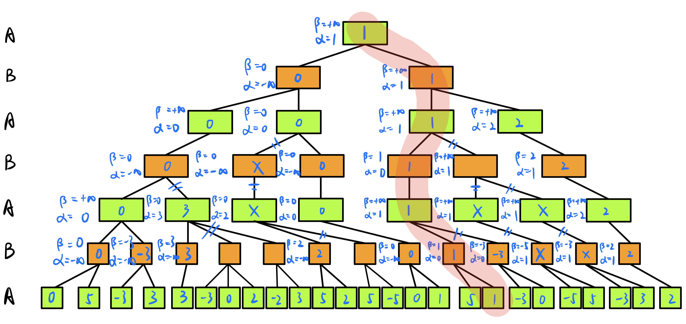
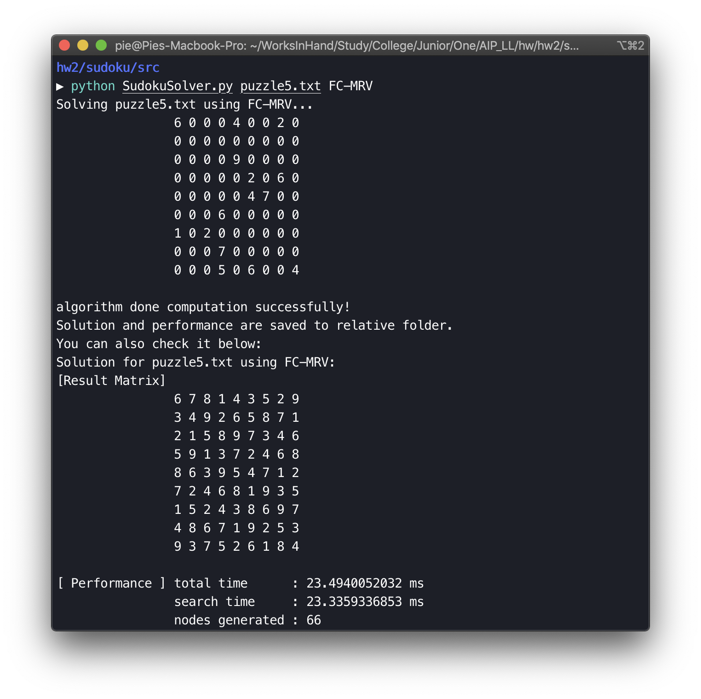

# 人工智能原理 Homework2

数据科学与计算机学院 软件工程专业 17343131 许滨楠


## ALPHA-BETA PRUNING

> Draw the diagram after alpha-beta pruning.




## Sudoku Solver

> Implement Sudoku Solver using following algorithm:
>
> - Brute Force
> - Back-Tracking (Constraint Satisfaction Problem, CSP)
> - Forward-checking with Minimum Remaining Values (MRV) heuristics

### 运行/测试方法

```shell
# cd 进入附件中的源代码目录
cd src
# 运行 SudokuSolver.py 文件，参数要求与 assigment 中相同
# 最后一个参数指定算法：BF/BT/FC-MRV
# 题目文件见附件，可为 puzzle0.txt(自建简单测试), puzzle1~5.txt
python SudokuSolver.py puzzle1.txt BF
python SudokuSolver.py puzzle1.txt BT
python SudokuSolver.py puzzle1.txt FC-MRV
```



### 思路解析

#### 基础功能函数

题目要求实现多种方法，但数据交互的底层需要使用的函数比较固定，先把基本的功能函数划分实现出来之后可被多个算法复用。各个功能函数的实现是比较简单的，只需简析。

下面简析算法队数据处理的模型以及功能函数的大致作用：

##### 算法模型

将数独题目表示为 9*9 的数字矩阵，有效数字为 1～9 ，0 表示空；

用单行/单列/单块的所有数字创建集合，通过判断集合大小是否为 9 且不包含 0 来判断是否满足条件；

##### 底层功能函数

- I/O 相关 - 包括对数独题目文件的读取、写出结果、写出算法性能、控制台打印结果、打印性能等：
	- `read_puzzle_file(filename)`
	- `write_puzzle(puzzle, filename)`
	- `write_performance(algorithm, puzzlefile, totaltime, searchtime, nodesnum, filename)`
	- `print_puzzle(puzzle)`
	- `print_performance(algorithm, puzzlefile, puzzle, totaltime, search time, nodesum)`
- 算法模型相关 - 包括对行、列、块的处理；数字获取；游戏结果判断等：
	- `judge(puzzle)` - 分别判断每行、每列、每块是否符合要求从而判断数独是否完成；
	- `get_groups(puzzle, cell)` - 该函数返回一个二维数组，其中包含三个一维数组，分别存放与 cell 指定的单元格处于同一行、同一列、同一块的数字；
	- `get_incomplete_cells(puzzle)` - 找到数独中尚未填上数字（值为 0 ）的单元格；
	- `get_possible_numbers(puzzle, cell)` - 根据该单元格所在行列块，列出该单元格可选的数字集合；
	- `get_mrv(puzzle)` - 返回一个三元组数组，每个三元组包括该单元格可选数字的数量、单元格坐标、单元格可选数字集合，并且按照可选数字数量升序排列，用于后续启发式搜索；
- 简单的算法剪枝函数：
	- 因为暴力搜索算法因为其扩展数的完全性，体系较大，如果题目难度较高，较短时间内找不到可行解，故考虑进行一定的复杂度为常数级的算法剪枝；
	- `prune_problem(puzzle)` - 该函数通过搜索，找到空格并判断其可选数字是否唯一，如果唯一则直接填入，重复此过程数次来实现剪枝，缩小搜索空间。

#### 算法实现

##### Brute Force

该算法的实现过程为：

- 找到当前未填的所有单元格，以及其对应的可选数字集；
- 计算各个单元格可选数字集的所有组合（笛卡尔积）以构建搜索集合；
- 逐个判断搜索集合中的各个节点，即将组合指定的各个节点选择的值填入之后判断解是否可行；
	- 若找到可行解，终止并返回；

在该算法中，扩展节点数量的计算规则为每假设一个单元格的值就增加 1，表示在搜索树的某层对下一层节点进行了一次深入搜索。

基本代码如下：

```python
def brute_force(puzzle):
    incomplete_cells = get_incomplete_cells(puzzle)         
    possible_set = []
    for cell in incomplete_cells:
        possibles = get_possible_numers(puzzle, cell)
        possible_set.append(possibles)
    # 获取组合
    search_set = itertools.product(*possible_set)

    for search_iter in search_set:
        for i, cell in enumerate(incomplete_cells):
            puzzle[cell[0]][cell[1]] = search_iter[i]
            global nodes_expanded
            nodes_expanded += 1
        
        if judge(puzzle):
            write_puzzle(puzzle, solution_file)
            return True
    
    return False
```


##### Back-Tracking (Constraint Satisfaction Problem CSP)

该算法的实现过程为：

- 找到当前需要填充的所有单元格；
- 每次填入一个单元格的某个可行解，继续深入搜索；
	- 如果搜索过程中出现还没找到可行解，某单元格已经无数可填的冲突则回溯；
	- 否则一直重复上述过程，并将已填节点从待填列表中删除；
	- 知道填完所有单元格，找到满足条件的可行解；

在该算法中，扩展节点数量的计算规则为每填充一个假设的解（即添加一套节点）就增加计数。

基本代码如下：

```python
def back_tracking(puzzle, cells):
    if judge(puzzle):
        write_puzzle(puzzle, solution_file)
        return True
    if len(cells) == 0:
        return False
    
    c = cells[0]
    for num in get_possible_numers(puzzle, c):
        global nodes_expanded
        nodes_expanded += 1

        puzzle[c[0]][c[1]] = num
        # print_puzzle(puzzle)
        if back_tracking(puzzle, cells[1:]):
            return True
        puzzle[c[0]][c[1]] = 0
    
    return False
```


##### Forward-Checking with (Minimum Remaining Values MRV) heuristics

该算法的实现思路和节点计算都与上一个算法十分类似，不同的基本只是在获取空单元格的时候获取的列表根据可选数字的多少进行了升序排序，保证算法有限搜索可能性较少的分支，能更快地深入搜索树达到叶节点/可行解，是一种启发优化的搜索。

基本代码如下：

```python
def forward_checking_mrv(puzzle):
    if judge(puzzle):
        write_puzzle(puzzle, solution_file)
        return True

    incomplete_cells = get_mrv(puzzle)
    if len(incomplete_cells) == 0:
        return False
    cell = incomplete_cells[0]
    c = cell[1]
    possibles = cell[2]

    for num in possibles:
        global nodes_expanded
        nodes_expanded += 1

        puzzle[c[0]][c[1]] = num
        if forward_checking_mrv(puzzle):
            return True
        puzzle[c[0]][c[1]] = 0

    return False
```


### 算法性能分析

> 在实际测试中，由于测试文件属于难度偏高、空格较多、搜索书较大的题目，使用基本无优化，只是对每个空格可选的数字进行初步限定的暴力搜索算法耗时很长，没有完全搜索计算到找到可行解。于是使用自己创建的比较简单的算例 puzzle0.txt 进行了基本功能性的测试。
>
> 在加入了之前提到的剪枝优化之后，暴力搜索的算法才可以在较短时间内接出第一个算例。因此在暴力搜索算法的算例中，未剪枝版本只有 puzzle0.txt 的算例测试，剪枝版本只有 0 和 1 的算例测试。其他两个算法在有无剪枝的情况下都进行了测试，结果保留在 src/ 目录下的各个对应文件夹中。

#### 各算法性能表现

（算法中 woP 表示 without Pruning 未事先剪枝；wP 表示 with Pruning 已经事先剪枝）

| Total Time(ms) | Brute Force woP | Brute Force wP | Back Tracking woP | Back Tracking wP | Forward Checking MRC woP | Forward Checking MRC wP |
| :------------: | :-------------: | :------------: | :---------------: | :--------------: | :----------------------: | :---------------------: |
|    puzzle 0    |      1.14       |      1.41      |       1.38        |       0.82       |           0.76           |          0.76           |
|    puzzle 1    |        \        |      2.66      |       1.82        |       1.98       |           2.08           |          2.12           |
|    puzzle 2    |        \        |       \        |       15.21       |      14.63       |          19.61           |          20.18          |
|    puzzle 3    |        \        |       \        |       23.05       |      23.85       |          52.59           |          52.78          |
|    puzzle 4    |        \        |       \        |       12.71       |      13.39       |          30.78           |          34.80          |
|    puzzle 5    |        \        |       \        |       9.73        |      10.26       |          27.61           |          30.32          |

（在节点剪枝过程中，除 0 1 两算例之外的算例对后两个算法搜索节点数量并无影响，因为他们不能通过找到可以唯一确定的空格来进行剪枝，所以表格中不再列出，后两个算法性能数据都是未剪枝情况下的）

| Nodes Expanded | Brute Force woP | Brute Force wP | Back Tracking | Forward Checking MRC |
| :------------: | :-------------: | :------------: | :-----------: | :------------------: |
|    puzzle 0    |       36        |    1(即达)     |      18       |          18          |
|    puzzle 1    |        \        |       28       |      94       |          41          |
|    puzzle 2    |        \        |       \        |      911      |          58          |
|    puzzle 3    |        \        |       \        |     1619      |         167          |
|    puzzle 4    |        \        |       \        |      542      |          86          |
|    puzzle 5    |        \        |       \        |      291      |          66          |


#### 简要分析

##### 关于剪枝

前面提及的简单剪枝，在有较多可以直接确定的单元格的算例中，对于暴力搜索的方法可以有效减少搜索分支，因此直接改变了暴力搜索的性能。但是在其他两种搜索方法，尤其是启发式的最少可能最优的 MRC 搜索算法中，反而因为进行了改良不大的剪枝而浪费了时间，因为启发式搜索本身已经会对可能性较少的节点优先遍历，会直接将唯一确定的空格填完再进行后续不确定空格的搜索，因此实现中完成的简单剪枝，对简单的暴力算法带来了提升，而于其他优化过后的算饭无大益。

##### 三种算法对比

**暴力搜索**因为其直接对整棵搜索树进行深度优先的搜索，搜索范围较大，费时很长，甚至在稍复杂的图中如果未加剪枝就运行数分钟未找到解。性能较差。即使因为算法简单，在简单图的搜索中也没有体现出优势。（除非是自己创建的只有数个空的测试图）

**回溯**类的算法搜索的过程中每一步都引入了判断，有一点类似 alpha-beta pruning 中 min-max 的剪枝过程，一旦发现某个分支行不通就剪掉其整棵子树，在暴力搜索的基础上提升较大。而且实现也比较简单，在比较复杂的算例中也能较快地找到可行解。

**预测性的 MRC**类算法，加入了启发因素即节点子分叉的数量，对搜索的方向有较好的指示作用，理论上可以更好地达到可行解。由于在选择节点进行搜索的过程中，MRC 启发式地优先搜索分支少的，可以更快确定的节点，减少了大量无用节点的搜索。其搜索的节点较其他算法非常显著地减少了。