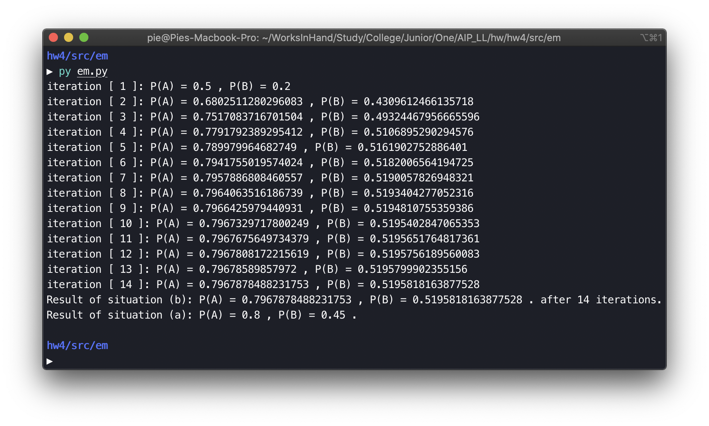
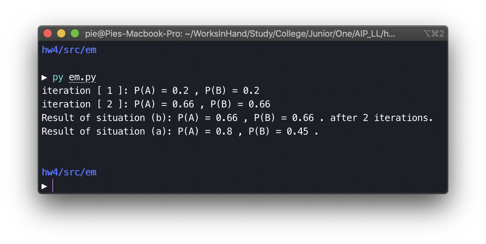
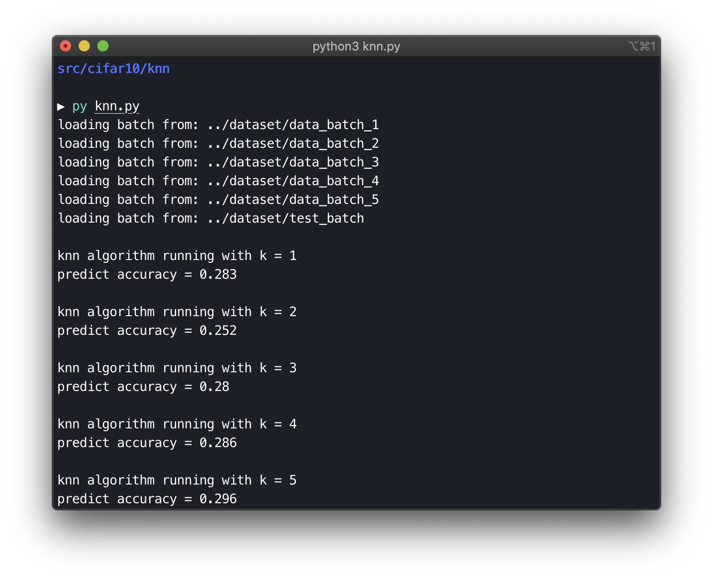
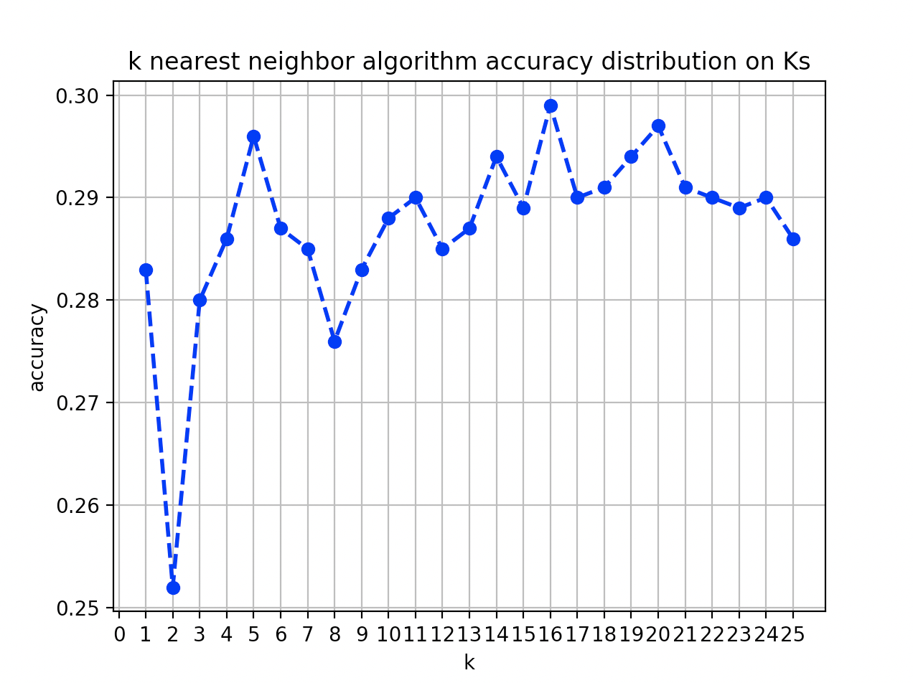
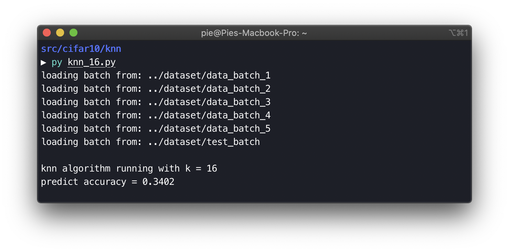
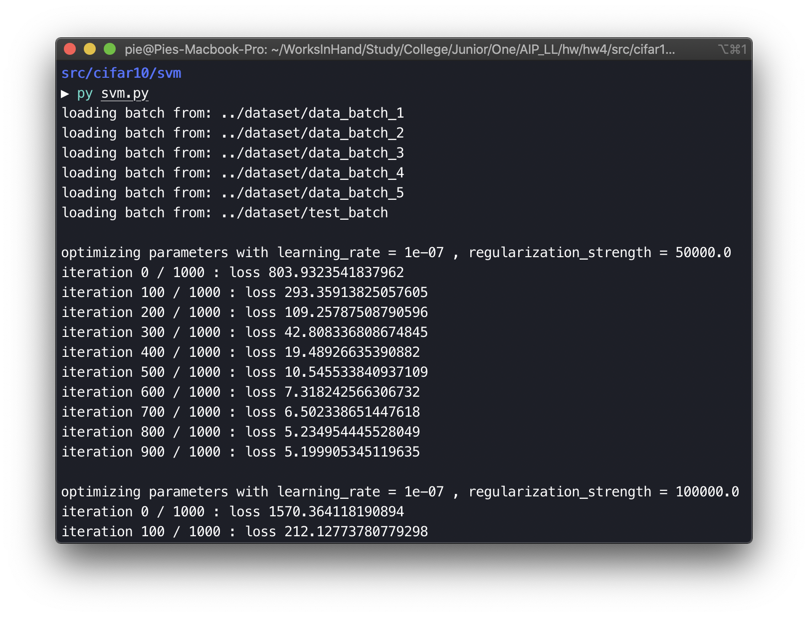
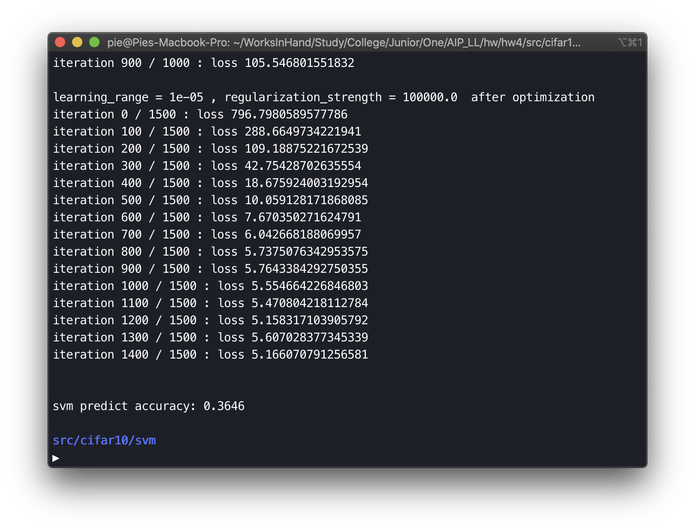
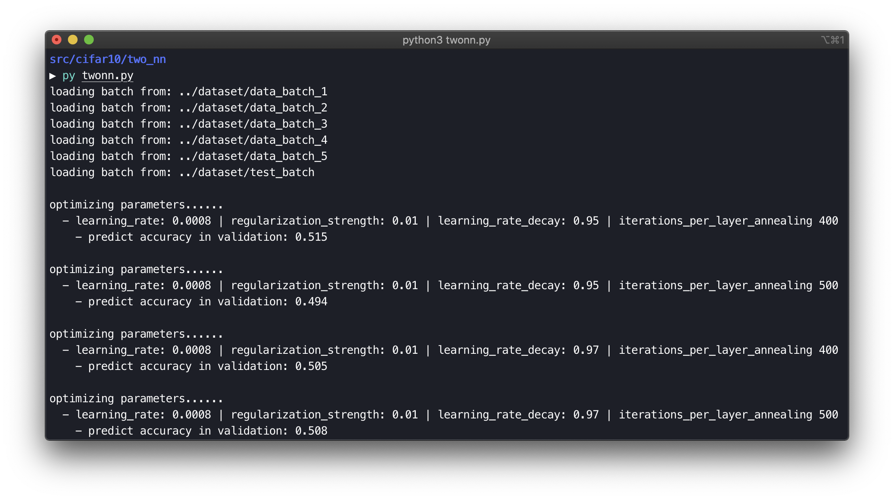
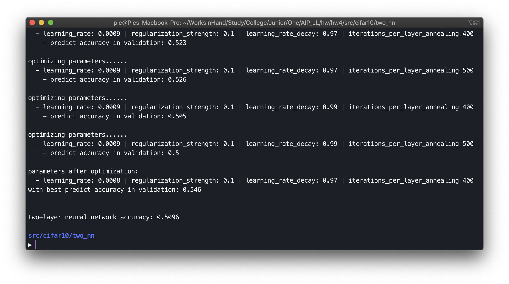

# 人工智能原理 Assignment4

<center>数据科学与计算机学院 软件工程专业 17343131 许滨楠


## EM 算法实验

> 使用 EM 算法实现双硬币模型中硬币抛掷结果为正面的概率计算。其中包含两种情况：
>
> a. 实验数据中每个硬币对应的实验是确定的；
>
> b. 实验数据中无法观测到实验选择的硬币是那个。

在 a 情况中，因为硬币的选择和实验结果是固定的，所以可以直接计算概率。用该硬币抛掷结果中出现正面的次数除以抛掷总次数，通过这种一定意义上的最大似然估计，可以得到对应硬币的正面出现概率，在这样的概率下，最有可能在实验中得到已经观察到的实验结果。

$$\hat\theta_A = \frac{24}{24+6} = 0.8\\\hat\theta_B = \frac{9}{9+11} = 0.45$$

而在 b 情况中，由于选择的硬币的不确定性，所以需要使用 EM 算法：

- 先给出猜测中两个硬币的正面朝上概率，进入 EM 算法；
- 在算法的 E 步骤中，根据二项分布计算两种硬币在对应概率下正面朝上的期望值；
- 在算法的 M 步骤中，根据上一步求得的期望重新计算两个硬币正面朝上的概率；
- 每一次 EM 两步骤执行完毕之后，判断算法在迭代中的收敛情况并累计迭代次数，如果迭代到达一定次数或者算法已经收敛到一定精度，则结束算法，返回迭代中计算得到的值。

按照这样的思路，最终通过实现 em 函数作为 EM 算法入口和迭代总控，em_step 函数作为每次迭代中 E 步骤和 M 步骤的封装，实现代码如下：

```python
import numpy
import scipy.stats as ss

observations = numpy.array([[1,0,0,0,1,1,0,1,0,1], [1,1,1,1,0,1,1,1,1,1],
                            [1,0,1,1,1,1,1,0,1,1], [1,0,1,0,0,0,1,1,0,0],
                            [0,1,1,1,0,1,1,1,0,1]])

p_a = 0.5
p_b = 0.5

def em_step(p_a, p_b, observations):
    a_h = a_t = b_h = b_t = 0

    theta_a = p_a
    theta_b = p_b

    # E step
    for obs in observations:
        obs_len = len(obs)
        total_head = obs.sum()
        total_tail = obs_len - total_head
        contribution_a = ss.binom.pmf(total_head, obs_len, theta_a)
        contribution_b = ss.binom.pmf(total_head, obs_len, theta_b)
        weight_a = contribution_a / (contribution_a + contribution_b)
        weight_b = contribution_b / (contribution_a + contribution_b)
        a_h += weight_a * total_head
        a_t += weight_a * total_tail
        b_h += weight_b * total_head
        b_t += weight_b * total_tail

    # M step
    p_a_t = a_h / (a_h + a_t)
    p_b_t = b_h / (b_h + b_t)

    return [p_a_t, p_b_t]

def em(observations, p_a, p_b, threshold, iterations):
    iteration_count = 0
    while iteration_count < iterations:
        iteration_count += 1
        p = em_step(p_a, p_b, observations)
        print("iteration [", iteration_count, "]: P(A) =", p_a, ", P(B) =", p_b)
        delta = numpy.abs(p[0] - p_a)
        if delta < threshold:
            break
        else:
            p_a = p[0]
            p_b = p[1]
    
    return [p, iteration_count]

if __name__ == "__main__":
    situation_a_theta_a = (observations[1].sum() + observations[2].sum() + observations[4].sum()) / 30
    situation_a_theta_b = (observations[0].sum() + observations[3].sum()) / 20
    res = em(observations, 0.2, 0.1, 1e-6, 10000)
    print("Result of situation (b): P(A) =", res[0][0], ", P(B) =", res[0][1], ". after", res[1], "iterations.")
    print("Result of situation (a): P(A) =", situation_a_theta_a, ", P(B) =", situation_a_theta_b, ".")

```

其中使用了 numpy 库支持简单的数学运算，使用 scipy 中 stats 库支持二项分布期望的简单计算。

最终运行结果如下（情况 a 的计算方法很简单，只需要简单实现；对于情况 b 的 EM 算法，参数设置的收敛精度均为 10^-6^）：

初始值按照 Assignment 中分别设置为 0.6 和 0.5 的运行情况如下：


设置为 0.5 和 0.2 的运行情况如下：



可见其比较不依赖于初始值设定，迭代中向期望结果收敛的速度也比较理想。但是如果将两个初始概率设置为相等，则会陷入困境：



---

## 图片分类任务

> 明确图片分类任务的基本流程；
>
> 清楚数据集的训练集验证集和测试集的划分和用途，简单介绍自己的用法；
>
> 编写 **K 近邻算法**，**SVM** 以及简单的 **两层神经网络** 多分类分类器各一进行图片分类任务；
>
> 根据得到的分类结果（精度）说明和比较各个算法的优越性和局限性，懂得它们之间的差异。

###### 算法需要的依赖包：numpy, pickle, scipy, pillow, matplotlib.pyplot 

### 实验要求解答

#### 图片分类任务的基本流程

图片分类任务中，限定了类别标签的范围，需要将给出的训练集/验证集作为已知条件，在此基础上对分类器进行训练（严格意义上如 K 近邻算法中，并不存在“训练”环节），建立分类器从图像到类别标签的映射关系或者映射倾向，而后在此基础上对测试集中的图片进行预测，预测中通过之前的训练基础或者是利用已知集对测试集进行计算分类，确定类别倾向，作出判断。大体上是一个输入为图像，输出为类别判断的任务流程。

#### 数据集划分和用途

在本次实验的数据集CIFAR-10数据集中，包含 10 类 32 x 32 的彩色图片，一共有 60000 张图片，每一类中包含 6000 张图片。其中50000张图片作为训练集（在 python 数据集中存放在 data_batch_1 至 data_batch_5 中，每个 batch 中有 10000 张图片其中包括每张图片和其对应的标签），10000张图片作为测试集（由每个类中随机选出 1000 张图片组成，存放在 test_batch 中，同样包含图片信息和对应标签）。数据集用途在上一部分中已经提及，具体的使用方法依算法各异，在算法实现报告中将阐明。

在数据集的基本处理中，每个 batch 中的 10000 张图片，被处理为一个四维数组，维度分别为：

- 10000，表示 10000 张图片；
- 3，表示 RGB 颜色模式的三个通道；
- 32 * 32，表示图片的分辨率，为 32 * 32，1024 像素。

对于数据集的基本读入和序列处理，下面的三个算法在实现中使用了同一个自定义包，其中包含将数据 batch 读入并完成上述处理的过程：

```python
import numpy
import os
import pickle
import scipy.misc

def load_batch(fp):
    print("loading batch from:", fp)
    with open(fp, 'rb') as f:
        data_dir = pickle.load(f, encoding='bytes')
        imgs = data_dir[b'data']
        labels = data_dir[b'labels']
        imgs = imgs.reshape(10000, 3, 32, 32).transpose(0, 2, 3, 1).astype("float")
        labels = numpy.array(labels)
        return imgs, labels

def load_cifar10(directory):
    img_set_temp = []
    label_set_temp = []
    for batch in range(1, 6):
        fp = os.path.join(directory, 'data_batch_%d' % (batch, ))
        imgs, labels = load_batch(fp)
        img_set_temp.append(imgs)
        label_set_temp.append(labels)
    img_set = numpy.concatenate(img_set_temp)
    label_set = numpy.concatenate(label_set_temp)
    del imgs, labels
    test_image_set, test_label_set = load_batch(os.path.join(directory, "test_batch"))
    return img_set, label_set, test_image_set, test_label_set
```


> 以下展示各个算法的实现思路和数据集处理方法，具体代码见附录中（ `src/knn/` - K 近邻算法、`src/svm` - SVM 算法、`src/two_nn/` - 两层神经网络算法）中源代码，参数在代码中进行了基本设置，可以直接用 Python3 运行。源代码不在报告中展示，只展示运行情况和可视化结果。

### K 近邻算法

K 近邻算法 K Nearest Neighbor 应该是原理最直观的一个算法：对于每张待分类的图片，在已知分类的图片数据集中计算待分类图片到每张图片的差异（距离），然后根据该图片在整个已知数据集中的距离分布，找到与其最接近的 K 张图片，这 K 张图片中出现次数最多的标签则判断为最有可能是待分类图片所属的类别标签。算法中比较重要的变量是这个 K 值，实验过程中通过使用小测试集和训练集，观察 K 值在样本中的性能表现，选出性能较好，正确率较高的 K 值，对整个 CIFAR-10 数据集进行测试。同时可视化结果。

算法的具体流程也比较简单，直接以文字叙述：

- 读入数据集并进行处理：
	- 使用 Python 的 Pickle 包和 os 包进行文件读写与解析；
	- 图片数据序列化为 [10000, 3, 32, 32] 形式；
- 划定使用的训练集数量和测试集数量，规范化图片数据格式方便后续运算；
- 对于一定范围内的 K 值（实验中选定了 1 ~ 25）：
	- 通过划定的数据集和给定的参数 K，进行 KNN 算法：
		- 通过矩阵向量运算的形式，对于测试集中的每张图片，计算其到训练集中每张图片的距离；
		- 将每张测试集图片的距离集合排序，选出最相近，距离最小的 K 张测试集图片；
		- 选出的 K 张测试集图片中，统计出现最多的分类标签，判断测试图片最有可能为该分类；
	- 算法执行完毕之后会得到对于测试集中所有图片的分类判定，根据这组判定，与测试集给定的分类标签进行比较，统计分类器判断正确率。
- 不同的参数 K 值的性能表现可视化展示和分析。

使用简单的小规模数据集观察 K 值表现：此处设定使用训练集范围为 10000 个（即训练集的 1/5），测试集选用 1/10，1000个，测试得 K 表现情况如下：



在上述计算过程中，使用 `matplotlib.pyplot` 包对参数 K 对应的算法性能进行可视化呈现如下：



可见大体上看 K值选择 16 的时候效果较好，接下来选择 K 值为 16，对完整的训练集和测试集进行分类实验，实验结果如下：



在经过较长时间的计算之后，完整 CIFAR-10 数据集在算法参数 K 为 16 的情况下的估计准确率如上，为 0.3402。虽然这样的 K 选择方式也许并不规范，但由于计算机性能和运算时间有限，这样的参数应该也是比较有代表性的了。

算法性能方面，虽然这样的算法实现之后的分类准确率在数值上并不高，但是如上面的运行结果，已经是随机猜测的正确率的三倍多了。至此 K 近邻算法实验告一段落。


### SVM

> 这个算法实现过程中参考了这篇资料：[基于SVM的思想做CIFAR-10图像分类](https://www.jianshu.com/p/28356215fdf8)。

SVM Support Vector Machine 支持向量机，该算法同样有一个比较直观的思路，即在两个特征相对明显的类别分布（正负样本）中，找到一条分割“线”（分类超平面）将两者划分开来，同时，易知如果这条“线”离两个类别的样本都较远，那么这条线的分类性能将会是比较好的，因为其对样本的偏差容忍度和鲁棒性更高，SVM 算法既是为了找出性能更好的分类标准从而进行分类，或者说尽量让所有样本离分类超平面尽可能远。

在 SVM 算法中，需要建立训练集、验证集和测试集，其中训练集用于训练获取样本权重，标定每一个像素位置在图片中的“分类重要性”，在对 SVM 分类器进行训练之后，用验证集对其分类能力进行验证，通过分析损失函数，使用梯度下降法迭代更新参数值，比较重要的参数是学习率（学习步长）和拟合中的正则化强度，在分析中获得较优的参数对之后，使用这组参数对测试集进行测试分类，统计正确率。

实验中数据集的划分如下：

- 抽出 CIFAR-10 数据集的训练集中 50000 张图片中的 49000 张作为训练集；
- CIFAR-10 训练集中剩余的 1000 张图片作为验证集；
- CIFAR-10 测试集中的图片作为最终分类器性能的测试数据。
- 数据预处理中，将所有图片处理为其与训练集图片平均值的差值，方便分类处理。

参数调整如下：

- 算法中的 delta 值设置固定为 1；
- 学习率和正则化强度预先规定范围进行测试，因为计算过程中很容易发生浮点溢出，经过多次调整后，最后将学习率调整在 [10^-7^, 10^-5^] 几个数值之间，正则化强度调整在 [5 x 10^4^, 10^5^] 几个数值之间，没有进行更大范围的参数优化，这个是可以改进的点（但这也是可以比较灵活修改的，支持通过简单修改 main 函数之中的参量进行更多的测试；
- 参数优化中的迭代次数设置为 1000 次，选取样本数设置为 200；
- 测试过程中迭代次数设置为较多的 1500 次，选取样本数设置为 100；

在以上参数设置下，运行结果为：





正确率与上一个算法 KNN 相近。实际实验中在进行更大范围的参数调整时，达到过 40% 以上的正确率，但是由于其中包含一些验证集的计算浮点溢出，不太稳定，最后没有采取该参数范围。因为计算规则和基准设置导致计算过程中出现了数据溢出反向限制了参数范围，这应该也是算法中的不足之处，也源于自己对算法没有完全理解和推导，如损失函数计算中的一些步骤是直接套用算法结论的，缺乏自行演算验证。


### 两层神经网络

> 这个算法实现过程中参考了这篇资料：[CS231N之两层神经网络的实现](https://zhuanlan.zhihu.com/p/25268643)，神经网络的设计使用了这篇博客中的模式。

（实验中原有参数对应的训练情况图表表示，为了避免运行时间过长影响结果显示和验证移除，一些日志和结果保存相关接口保留。）

实验中实现了一个层与层之间全链接的、具有一个隐藏层的两层神经网络。其输入层是图像数据，处理方法与上一个算法 SVM 中的处理方法相同，用所有方法通用的读取器和序列化规则进行处理之后，分出训练集、验证集和测试集，（同样是在 CIFAR-10 中，49000 张训练集图片作为训练集、余下的 1000 张训练集图片作为验证集、10000 张测试集图片作为测试集）然后所有图片都与训练集图片数据的平均值做差，减少数据大小，方便表示和计算，并统一规格以便进行后续矩阵计算，至此都还是与 SVM 算法中的数据准备处理基本一致的。

然后会进行参数设置，之后一并传入分类器。首先会通过和 SVM 算法中相似的参数优化器，完成各个参数的确定，因为两层神经网络实现中计算量比较大，运算起来比较慢，因此参数的初始设置和数量级范围大致参考了博客中的参数设置，在优化器中，使用之前划定的训练集，遍历参数集合中的参数列表进行试探，训练完成，分类器中的各个参数确定之后，使用训练之后获得的模型，利用验证集进行验证，统计判断的正确率。

在上面的迭代中，维护保存正确率最高的分类器参数和分类器实体，完成遍历之后，使用最优的模型进行测试，统计分类器对测试集的判断的准确率。

与前面算法相同，在程序的主程中设置参数交给迭代过程测试，此处结果展示只选取较小范围内的，对于性能比较有代表性的展示结果：





### 算法简单分析与对比

算法中比较重要的、通用的一点是对直观的图片概念的特征分析与计算模型。不管是量化比较，还是成果模型的损失分析，但需要用到这一步骤（如 KNN 算法中，需要对图片之间的“差别”进行量化），这应该是图片识别分类问题中比较关键的步骤。一开始除了逐像素、逐通道作差的方法，毫无头绪，后来在参考资料中了解到可以使用 Python 中 Numpy 库提供的 API 对

#### KNN

K 近邻算法是一种比较简单的分类算法，原理非常直观。找到特征分布中与待分类主体最相近的 K 个样本，取这 K 个样本中出现最多的类别即判断为待分类主体所属类别。算法特点是不需要进行分类器训练，简单的模型中分类只依赖于已有的样本数据。这样的简单性在实现和使用上是优点，因为其简单易用，但是在效果上就变成了缺点，对于唯一的参数 K，如果 K 取值过小，则分类器的判断力容易受一些异常数据限制，具有局限性，如果 K 取值过大，又使得实际的样本容差过大，很容易纳入差别过大的样本。

在实验中这种理想情况，可以通过对部分测试集（其实在这里作为验证集）的试探，确定表现较好的 K 值，然后投入完整测试的使用，但是在实际运用情境下，KNN 算法的性能可能会十分有限，实验中也已经提现了，在通过验证选用表现较好的 K 值时（K 值之间的差异还是可以很大的，观察 K = 2 时的正确率明显较低可知），十个分类标签下的正确率也只有“盲猜”的三四倍。

KNN 算法因为其简单，易于实现理解，同时也无需估计参数和训练，具有其应用价值，比如在简单的，特征明显的事件分类中，会有较好的表现，同时还简单，在这样类型的问题中可能会比此次实验中优于其的其他两个算法更好。但是如果在样本不平衡的应用情况（比如某类样本数量少于其他样本，则同类数据的识别率将收到影响，而如果分类器具有反馈环节，则将使这样的情况恶化）中性能将下降。同时因为其“无差别”的计算需求 - 任何测试数据都需要与同样多的样本数据进行距离计算，其开销较大。

#### SVM

支持向量机的算法被称为一种”监督式学习”的方法，定义上属于一般化的线性分类器。在实验中的理解尚浅，实现之后的算法性能也不甚可观，但至少明确了其概念和思路。比较重要的是核函数的给定，如果有合适的模型支持，SVM 算法在一些特征空间较大，或者是特征非线性的问题中可能会有较好的性能表现。但同时，在其基本思想 - 找到最好的“分割线”的基础上，一般的 SVM 算法只支持二分类。

核函数是 SVM 算法中的核心内容，本次实验中的核函数给定并不太考究，可能这也是其性能不佳的主要原因。这也确实是 SVM 算法实现中的重点，合适的核函数选取能让 SVM 发挥出更大的能力。

#### 神经网络

神经网络通过计算和确定每一层中的前向传播和后向传播，实现输入输出之间的映射和误差修正。宏观上是一种映射关系的建立和修正调整。利用训练集确定每一层的参数（包括权重和各系数），再利用验证集和损失函数进行参数调整，建立映射关系，然后复现式地将待测试分类的数据作为输入，输入到神经网络中，根据输出获得对应的分类结果。

通过大量数据训练调整出的神经网络，其映射关系应该具有比较明显的倾向并且对样本中抽出的测试数据具有较好的预测效果。实验中虽然只试验了比较基础的两层神经网络，但是其分类正确率对比起前面两个算法已经有明显的提高。虽然比起目前比较优秀的对 CIFAR-10 的分类测试的 80%、90% 水平还很有差距，但是在参数调整范围较小、神经网络深度较低的实验中已经比较可观了。