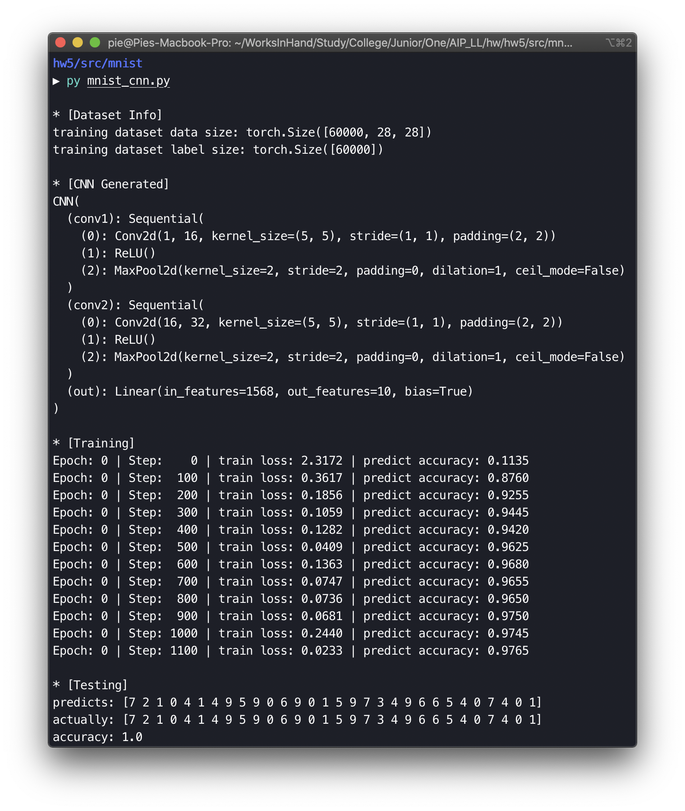
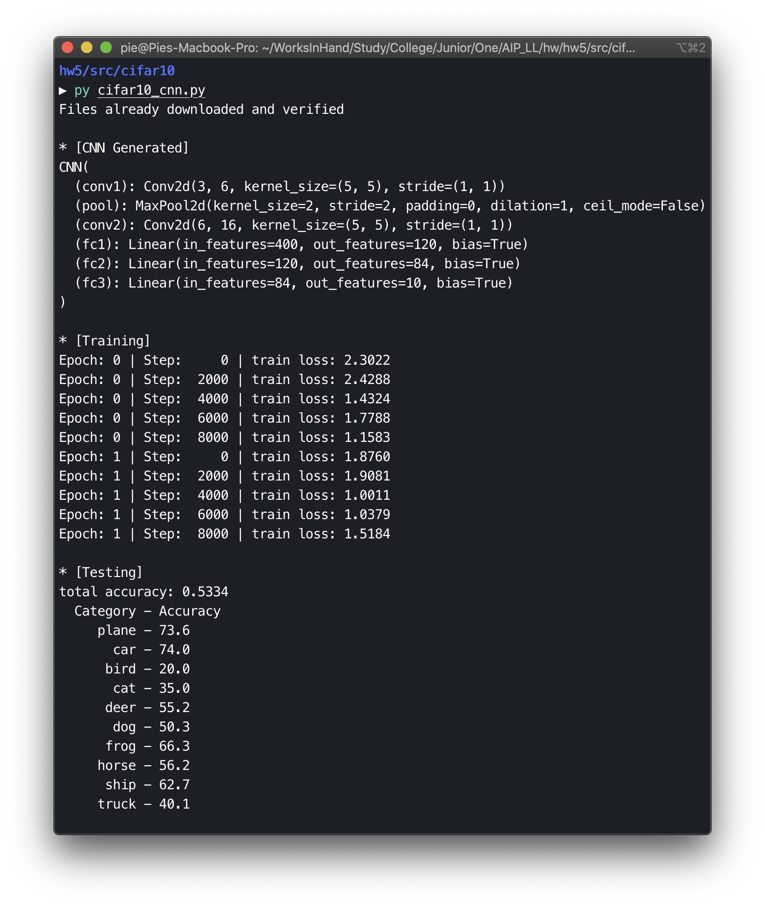

# 人工智能原理 Assignment5

数据科学与计算机学院 软件工程专业 17343131 许滨楠


## CNN 设计与实现

> 实验环境
>
> - Python 版本：Python 3.7.5
> - 平台：深度学习平台 Pytorch
> - 操作系统：macOS Catalina 10.15.1
>
> 实验中的源代码在目录 `src/mnist` / `src/cifar10` 中，其中设置了自动下载数据集，可以直接使用 Python3 运行。

### MINIST

> 设计并实现 CNN 模型，对 MNIST 手写字符数据集进行分类。
>
> **要求**：利用 MNIST 的训练集训练，利用测试集测试。完成实验代码，和实验报告一起提交；
>
> **参考**：[MNIST 数据集介绍](https://blog.csdn.net/simple_the_best/article/details/75267863)

#### CNN 设计实现

##### 工具库使用与引入

```python
import torch
import torchvision
import torch.nn as nn
import torch.utils.data as Data
from torch.autograd import Variable
```

实验中使用的平台 Pytorch 提供了许多实用的工具库，在对 MNIST 手写字符数据进行分类的时候使用了以上工具，方便对实验使用数据集的处理和模型的生成。使用 torch.nn 生成神经网络各层；torch.utils.data 对数据集进行简易处理；torchvision 引入 Pytorch 内置的数据库下载数据集；torch.autograd 中的 Variable 处理参量的调整。

##### 超参设定

```python
EPOCH = 1
BATCH_SIZE = 50
LEARNING_RATE = 1e-3
```

根据主机性能和效果调整得出，主要包括传递次数 EPOCH、单批处理中的样本总数 BATCH_SIZE、学习率 LEARNING_RATE。

##### 数据获取与预处理

```python
train_data = torchvision.datasets.MNIST(
    root='./dataset',
    train=True,
    transform=torchvision.transforms.ToTensor(), # domain (0, 1)
    download=DOWNLOAD_MNIST
)
train_loader = Data.DataLoader(
    dataset=train_data,
    batch_size=BATCH_SIZE,
    shuffle=True,
    num_workers=2
)
test_data = torchvision.datasets.MNIST(
    root='./dataset/',
    train=False
)
test_x = Variable(
    torch.unsqueeze(
        test_data.data,
        dim=1
    ),
).type(torch.FloatTensor)[:2000]/255.
test_y = test_data.targets[:2000]
```

标定 root 设置本地存放数据集的根目录，train 为 True 标示下载数据集中的训练集（后续测试集反之），同时设定 transform 使其自动转换为 Tensor 格式，手写字符集是黑白图片，将图片每层的表示数据范围从 (0, 255) 缩小到 (0, 1)，然后将下载好的数据水用 DataLoader 工具导入成可迭代集就可以了。测试集的导入处理类似，但是没有使用 transform，手动将数值除以 255 就可以实现压缩了。同时，为了节约性能，截断使用前面 2000 个数据进行测试即可。

##### 卷积神经网络设计

实验中建立了一个具有两个卷积层的卷积神经网络：

- 在第一个卷积层中，设置原始图片高度为 1（黑白图片单通道）、过滤器数量/扫描后生成特征高度为 16、扫描窗口大小为 5 * 5、扫描步长 为 1、padding 填充，为了使扫描生成的特征“图片”大小和原图片相同，使用 2（除了高度，单位都是像素），同时设置池化层的单位为 2 * 2，采用最大池化，从每个 2 * 2 单位中选择最大值作为特征标定；
- 在第二个卷积层中，对应的参数变为：原高度为上一层高度 16、特征高度进一步设置为 32、窗口大小仍为 5 * 5、步长仍为 1、padding 填充仍为 2，池化层也与之前相同；
- 输出层中，利用 torch.nn 中的 Linear 接口，定义最后生成的特征“图片”体积 32 * 7 * 7 （原先 28 长宽经过两次 2:1 缩放长宽为 7），一共有 0~9 十个类别；
- 设定前向传递层串联各层，而后进行扁平化操作，使用从 nn.Module 继承到的 view 接口保留第一个维度 (32 * 7 * 7) ；
- （最后生成的模型在程序运行中进行了打印）

##### 训练测试过程

建立完模型之后就是常规的优化参数、训练、测试过程了。

使用平台提供的参数优化器 torch.optim.Adam 进行参数优化，传入之前设定的超参学习率，用 torch.nn 中的 CrossEntropyLoss 作为损失函数。之后以 EPOCH 次传递迭代之前生成好的 train_loader，逐批进行处理，每一步都是载入一批数据进行处理，将数据中的 data 部分传入卷积神经网络、获取输出、计算损失、调用优化器进行参数优化、后向传播计算梯度下降、优化。（实验中每隔一段处理将输出训练情况，便于了解训练过程。

最后，完成神经网络训练之后，从测试集中抽取了 30 个数据样例进行显式测试 。

##### 程序运行结果




### CIFAR-10

> 设计并实现 CNN 模型，对 CIFAR-10 图像数据集进行分类。
>
> **要求**：利用 CIFAR-10 的训练集训练，利用测试集测试。并完成实验代码，随实验报告一起提交。
>
> **参考**：[CIFAR-10 数据集主页](https://www.cs.toronto.edu/~kriz/cifar.html)，[CIFAR-10 数据中文简介](https://blog.csdn.net/DaVinciL/article/details/78793067)。

#### CNN 设计实现

CNN 处理图像识别的流程大同小异，所以对 CIFAR-10 数据集的分类和前面对 MNIST 的分类思想相同，不同之处只在于数据集导入参考了不同数据集说明进行预处理，并且测试中因为准确度没有数字识别高，而且各种样例间差异较大，测试中经过一定程度迭代取出较优参数直接对整个测试集进行测试，并分别统计每个类别的判断准确性。总体的流程与上一个算法相同，只在神经网络设计上进行了主要改动。

##### 卷积神经网络设计

```shell
CNN(
  (conv1): Conv2d(3, 6, kernel_size=(5, 5), stride=(1, 1))
  (pool): MaxPool2d(kernel_size=2, stride=2, padding=0, dilation=1, ceil_mode=False)
  (conv2): Conv2d(6, 16, kernel_size=(5, 5), stride=(1, 1))
  (fc1): Linear(in_features=400, out_features=120, bias=True)
  (fc2): Linear(in_features=120, out_features=84, bias=True)
  (fc3): Linear(in_features=84, out_features=10, bias=True)
)
```

- 输入层：上一个实验中处理过，RGB 三通道的小图尺寸是 3 * 32 * 32；
- 卷积层1：输入为 3、过滤器特征高度为6、窗口大小 5 * 5、步长为 1、padding 为 0；
- 池化层：与上一个算法相同，定义一次，在两个卷积层后都分别使用；
- 卷积层2：对应各项参数为 6、16、5 * 5、1；
- 两层全连接层：扁平化操作，与上一个算法相同使用 view 接口；
- 最后一层 softmax 层：定义十个节点对应最终十个 CIFAR-10 数据集中的分类。

##### 程序运行结果

